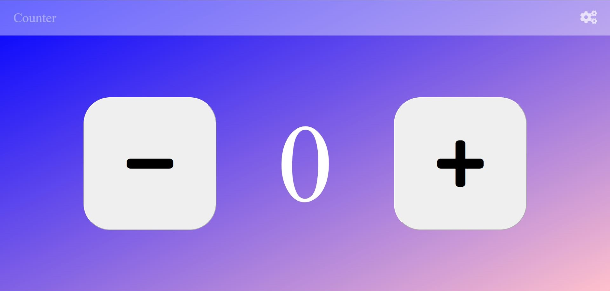

# Counter Project

## About The Project

This project is a simple counter application with no particularly advanced functions, but with an attractive and minimal design and is obviously totally responsive.

## Getting Started
To Starting using this Application, download the project and open the file "counter.html" on your favourite browser.

## Usage

The use is of a simple counter, then you can increase or decrease the number. Also there are advanced features that allow you to change the number to increase or decrease.

## Contact
Email: rey.hossa.rh@gmail.com

Project link: https://github.com/rey-hossa/Counter-Project.git

